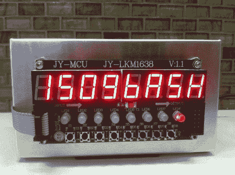

# 不同性质的字钟

> 原文：<https://hackaday.com/2012/08/30/word-clock-of-a-different-nature/>

这个工作时钟以一种意想不到的方式运行。随着时间的流逝，它会在显示屏的右侧随机显示一个四个字母的单词。传统的单词钟[用自然语言](http://hackaday.com/2012/08/28/wide-word-clock-takes-a-modular-approach/)报时，但是这个只是作为一个学习的机会。

[钢铁丛林]只花了 5 美元就从 Deal Extreme 买到了这个展品。看起来价格上涨了两美元，但仍然很便宜。他希望使用显示器的所有八位数字，并寻找机会同时控制多个 i2c 设备。他最终在设计中加入了 EEPROM 和 DS1307 RTC。他认为可以在四个数字上显示 24 小时时间，并从 EEPROM 中取出一个四字母单词库来填充其余的数字。他从互联网上抓取了一个单词列表，然后使用 Python 脚本删除了包含 7 段不友好字符(K，M，V，W，X，Z)的单词。最后一步是用一个回收的继电器给时钟一个滴答的声音。休息过后，请在片段中亲自聆听。

[https://www.youtube.com/embed/p6gUPq4odiE?version=3&rel=1&showsearch=0&showinfo=1&iv_load_policy=1&fs=1&hl=en-US&autohide=2&wmode=transparent](https://www.youtube.com/embed/p6gUPq4odiE?version=3&rel=1&showsearch=0&showinfo=1&iv_load_policy=1&fs=1&hl=en-US&autohide=2&wmode=transparent)