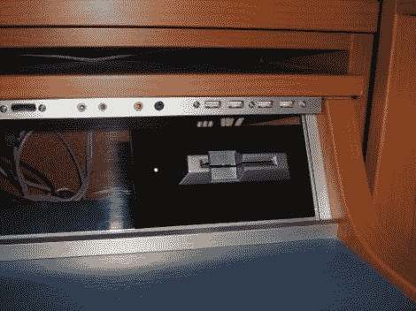

# 工作站包括用于 USB 端口的智能卡锁

> 原文：<https://hackaday.com/2012/08/14/work-station-includes-a-smartcard-lock-for-usb-ports/>

该工作站上的 USB 端口被锁定。为了使用 USB 设备，您需要[将智能卡插入上面的读卡器](http://www.pcbheaven.com/userpages/Smartcard_USB_Lock/)。有趣的是，这不应该影响你给 USB 设备充电的能力。当您访问上面的链接时，请务必查看工作日志选项卡，因为它包含九页的构建信息。

这个装置由两部分组成。一块电路板负责 USB 切换，另一块负责智能卡阅读器。该阅读器基于 PIC 16F1939。它读取智能卡，验证数据，然后通过 SPI 控制 USB 开关板。ADG714 芯片通过八条数据线完成电路，构成四个 USB 端口。板上还有一个机械继电器，可以切断 USB 电源。由于这与数据切换是分开的，因此电源可以保持打开以进行充电，或者由具有充电权限但不使用数据端口的卡单独切换。休息之后，您可以看到系统嵌入的演示。

[https://www.youtube.com/embed/hBa5TIVNaQA?version=3&rel=1&showsearch=0&showinfo=1&iv_load_policy=1&fs=1&hl=en-US&autohide=2&wmode=transparent](https://www.youtube.com/embed/hBa5TIVNaQA?version=3&rel=1&showsearch=0&showinfo=1&iv_load_policy=1&fs=1&hl=en-US&autohide=2&wmode=transparent)