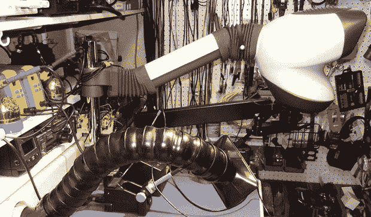

# 一种内置除焊烟装置的工作台

> 原文：<https://hackaday.com/2014/02/23/workbench-with-built-in-solder-fume-extractor/>

没有什么比看到充满焊料烟雾的眼睛更好的了，但是在焊料烟雾提取方面，最常见的解决方案需要占用大量工作空间。[这里有一个非常聪明的焊料烟雾提取器](http://corgitronics.com/2013/11/03/fume-extractor/)不会碍事，可以完美地放置在焊接站的辛辣硫磺之上。

该建筑包括一个廉价的浴室排风扇，安装在工作台的后面，通过一根长长的 PVC 管将废气吹到几英尺外的地板上。风扇由一个简单的墙壁开关控制，但进气口是这个建筑真正发光的地方。这是一系列[硬而柔韧的塑料段](http://www.loc-line.com/vacuum.php),允许吸入口精确地定位在工件上方，或者任何最方便吸取焊料烟雾的地方。

这个焊烟提取器只是[一个非常神奇的电子工作台](http://corgitronics.com/the-bench/)的一部分。这个工作空间考虑了很多，从工作面上的螺纹插件到安装一个 panavise，再到一个非常体贴的计算机、显示器和其他各种重型设备的设备架。

via [被黑的小工具](http://hackedgadgets.com/2014/02/22/diy-solder-fume-extractor-built-into-electronic-workbench/)