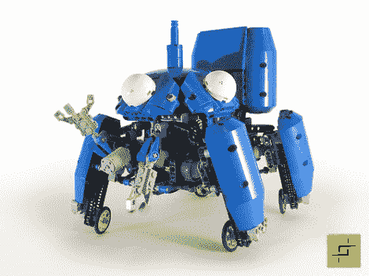

# 工作的 Tachikoma 使漫画栩栩如生

> 原文：<https://hackaday.com/2012/04/03/working-tachikoma-brings-the-manga-to-life/>

这个乐高 Tachikoma 就像电视节目里一样开车和走路。休息之后，你只需看一眼视频。我们已经看了好几遍，并不认为有任何编辑魔术在进行。但这些动作如此吸引人，我们中的一部分人认为其中有猫腻。

每条腿都有一个轮子，通过链传动与马达相连。但是这个小家伙并不局限于光滑坚硬的表面。当情况变得艰难时，他就像八岁的孩子穿着旱冰鞋穿过草坪一样昂首阔步。

这不仅仅是为了展示，如果你喜欢，你也可以自己建造。顶部的链接有组装说明。你需要几个特殊的零件，尤其是组成蓝色圆形底盘的水泥搅拌机半鼓。

不确定这到底是什么东西？不要难过，你需要[成为*壳里鬼*的粉丝才能认出它](http://en.wikipedia.org/wiki/Tachikoma)。

[https://www.youtube.com/embed/dargOslomMA?version=3&rel=1&showsearch=0&showinfo=1&iv_load_policy=1&fs=1&hl=en-US&autohide=2&wmode=transparent](https://www.youtube.com/embed/dargOslomMA?version=3&rel=1&showsearch=0&showinfo=1&iv_load_policy=1&fs=1&hl=en-US&autohide=2&wmode=transparent)

[via [极客原生](http://www.geeknative.com/27267/motorised-lego-tachikoma-is-mega-awesome/)