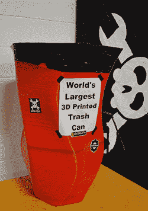
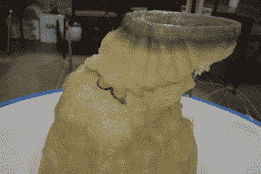
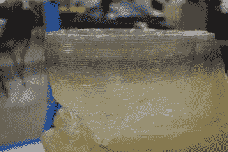
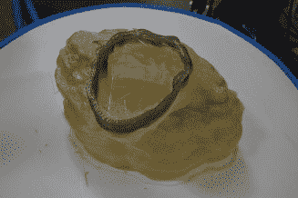
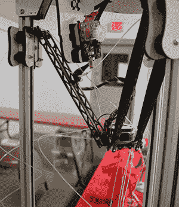
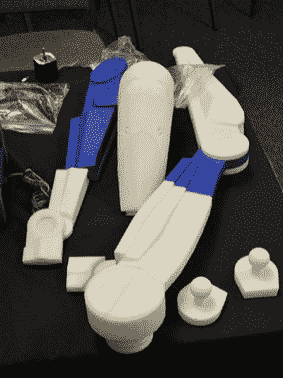
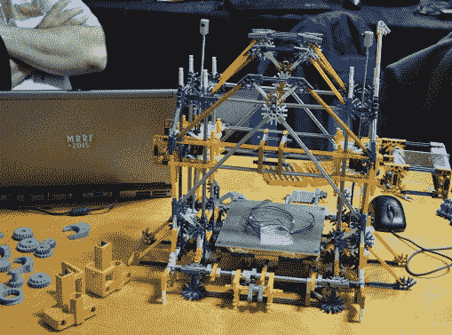
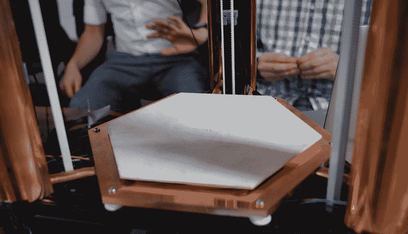

# 结束上一届中西部说唱音乐节

> 原文：<https://hackaday.com/2015/03/27/wrapping-up-the-last-midwest-reprap-festival/>

中西部说唱节结束了——永远结束了。这是最后一个。显然有足够多的人抱怨印第安纳州的歌珊不在中西部。我经过的奶品皇后的数量与此矛盾，但无论如何。明年，歌珊将会有一场*不同的*骗局。同样的内容，不同的名字。如果你有一个建议，你知道把它放在哪里。

  The world’s largest 3D printed trash can. People were taking pictures of them standing next to it.  The Groot fail  Contaminated with masterbatch  What the infill looks like on the PartDaddy

我承诺了世界上最大的 3D 打印垃圾桶，我给了你世界上最大的 3D 打印垃圾桶。这个巨大的橙色花瓶是几个月前在纽约创客节(NYC Maker Faire)上由 SeeMeCNC 的 18 英尺高的 delta 打印机 PartDaddy 打印的。从那时起，我就把它当作地下室的垃圾桶使用，[这让我成为维基百科上唯一拥有自己垃圾桶的人之一](http://en.wikipedia.org/wiki/3D_printing)。

A failed print on Saturday morning

说到爸爸，这就是失败的样子。第一个 PartDaddy 打印是一个格鲁特，一个 13 小时长的打印工作。它整夜都在运转，但在凌晨 4 点左右耗尽了 PLA 子弹。如果你想知道格鲁特脸上的黑带是什么，这里有详细的说明:

PartDaddy 从垃圾桶(不是 3D 打印的)中吸取 PLA 颗粒，并将其分配到打印头上方的漏斗中。这个漏斗是在零件 Daddy 上 3D 打印的，里面还有一点可乐兰特的灰尘。当 PLA 颗粒用完时，粉尘嵌入挤出物中。当你意识到母料只占成品塑料的 5%左右时，并不需要太多的黑色灰尘就可以使印刷品变色。

是的，这是一个打印故障，可以通过通宵狂欢来修复。其他一些人让打印机通宵运行，包括[【伟大的弗雷迪尼】和他的 Scan-A-Rama](http://thegreatfredini.com/scan-a-rama/) 。这是一个罗斯托克马克斯有一些不稳定的事情发生与鲍登。到处都是细丝。

一些星球大战机器人怎么样？机器人建造者俱乐部的 R2 也在那里，但也有完全 3D 打印的罗杰的雏形。当我们谈到塑料机器人会在一瞬间分崩离析时，有一台 K'NEX 3D 打印机出现了。是的，它几乎完全是由 K'NEX 制成的，而且一度确实有效。旁边那些橙色的部分？这些是从 K'NEX 打印机出来的。如果你在寻找一个明确的答案，那就去吧。

  Roger Roger, or a B1 Battle Droid  K’NEX Printer  Lincoln death mask in bronzefill. Patinaed with vinegar.

### 新灯丝

在过去的几个月里，金属细丝——含有铜、黄铜、青铜、铁或铝的微小颗粒的 PLA 已经出现。MRRF 是第一个你可以看到他们在一起的地方。需要注意的几件事:这些细丝很重——打印出来的物体实际上感觉像是由金属制成的。它们实际上也是金属:铁基灯丝有一点点红色腐蚀，上面的林肯死亡面具用醋酸处理过。这些灯丝在 T2 也很贵，1 公斤大约 100 美元。不过，如果你想打印 100 年后的东西，这是你应该得到的。

### 史上最漂亮的打印机

MRRF 应该在展会上举办一场最好看的 3D 打印机比赛。一个来自底特律摇滚城市的美丽三角洲将会胜出:

中间的白色六边形是陶瓷印刷电路板，我听说它花了一大笔钱。在陶瓷构建板下面，在床和大型铜散热器之间有几个 Peltiers。散热器通过热管连接到三个竖板，使整个打印机成为一个巨大的散热器。为什么会有人做出这么神奇的装饰艺术打印机？[为此](https://www.youtube.com/watch?v=6ahLXx721g0&feature=youtu.be)。

因为你可以使用 Peltiers 来加热*和*冷却床，所以在打印结束时的一点点 GCode 会将床冷却到室温以下。如果你的设计做得好，这意味着当它完成时，印刷品会掉下来。当打印床冷却时，您可以实际听到打印床和打印裂缝之间的粘合声。它很漂亮，很酷，我听说这台打印机很快就会进入 hackaday.io。

* * *

给你，上一届中西部说唱音乐节上最棒最酷的。再也不会有下一个了。它只需要一个更好的名字，SeeMeCNC 的[约翰]是*想出名字的高手。[就问什么 VIP 是](https://github.com/seemecnc/VIP)的 backronym。*

[我告诉过你会有 t 恤炮](https://www.youtube.com/watch?v=HcsHF8TWv5g)。那是 300 磅/平方英寸的车间空气。