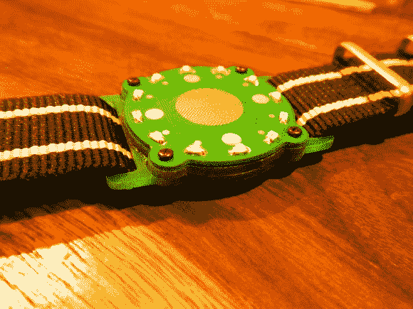

# 由夹层印刷电路板制成的手表

> 原文：<https://hackaday.com/2013/04/28/wristwatch-made-of-sandwiched-pcbs/>

这是一个我们从未见过的腕表概念。它使用一堆印刷电路板作为手表的主体，而不是试图将所有东西都夹在一个盒子里。

[Mats Engstrom]写信告诉我们他的身材。这种设计与 led 搭配，并不新奇。但与之前的产品不同的是，Mats 没有配备每分钟一个 LED 灯的功能。当手表中间的触摸传感器被激活时，表盘上的 12 个 led 会让你知道小时和最近的五分钟。休息之后会插入一段视频。

该设计使用三种不同的电路板。底板是最大的，并且提供了可以连接腕带的插槽。它也是两个电池连接器之一。第二块 PCB 是一个垫片，带有一个为器件供电的纽扣电池开孔。顶部的板子是所有魔法发生的地方。它是双面的，可以容纳 led 和触摸传感器，另一面是 PIC 微控制器和支持电路。

[https://www.youtube.com/embed/HAK1QthG-L8?version=3&rel=1&showsearch=0&showinfo=1&iv_load_policy=1&fs=1&hl=en-US&autohide=2&wmode=transparent](https://www.youtube.com/embed/HAK1QthG-L8?version=3&rel=1&showsearch=0&showinfo=1&iv_load_policy=1&fs=1&hl=en-US&autohide=2&wmode=transparent)