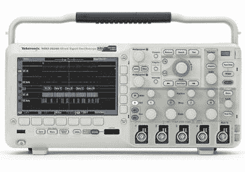

# 写一篇论文，赢得泰克示波器

> 原文：<https://hackaday.com/2013/08/23/write-an-essay-win-a-tektronix-scope/>

想要一个新的黑客乐趣范围吗？3650 美元的怎么样？这个价格标签让我们畏缩，这就是为什么我们正在努力完成我们的 1k 单词作文以赢得一篇。上图中的泰克 MSO2024B 是[家族中的顶级示波器](http://www.tek.com/oscilloscope/mso2000-dpo2000)，它的功能多得让人垂涎欲滴。需要更多动力？查看下面的演示/广告视频，该视频概述了该产品系列所能提供的内容。

该比赛由 EETimes 和 Tektronix 赞助，旨在奖励修复产品的最佳故事，该产品交付时令人失望，但当你完成黑客攻击时却非常棒。你的 1000 字或更少的作品应在 10 月 26 日之前提交，同时提交一份 50 字的自我介绍，获胜者将在万圣节宣布。请注意，您必须注册一个帐户才能获得资格，但在撰写本文时，我们达到了他们的每日文章查看限额，因此您可能需要登录才能阅读有关比赛的信息。或者清除他们的 cookie……我们毕竟是黑客网站。

他们只赠送了一台示波器。所以不要推迟这个。开始润色你的完全虚假的合法故事，关于你如何用疯狂的工程技术修理东西。

[https://www.youtube.com/embed/WksvXEzDErU?version=3&rel=1&showsearch=0&showinfo=1&iv_load_policy=1&fs=1&hl=en-US&autohide=2&wmode=transparent](https://www.youtube.com/embed/WksvXEzDErU?version=3&rel=1&showsearch=0&showinfo=1&iv_load_policy=1&fs=1&hl=en-US&autohide=2&wmode=transparent)