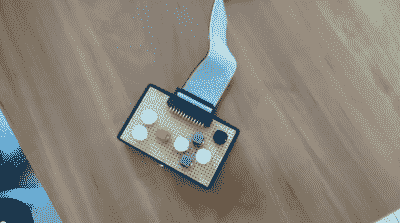

# 为树莓派写下厄运

> 原文：<https://hackaday.com/2015/07/06/writing-doom-for-the-raspberry-pi/>

我们以前都看过覆盆子 Pi 上玩的毁灭战士…但这不是游戏的一部分。不，这是伦敦帝国理工学院的一个学校项目——用裸汇编写游戏。他们是从头开始写的。

Complete with a custom home made controller connected directly to the GPIO pins!

没错。Pi 上甚至没有操作系统。这是 9800 行裸金属臂组件。如果这不会伤害你的大脑，我们不知道什么会！

他们使用了游戏的官方纹理，这不是一个完美的复制品，但已经非常接近了。

该项目的一部分是建立一个模拟器，使测试游戏变得更容易，但它不是最大的——所以大多数实际的游戏开发是在实际的硬件上进行的。呀！

休息过后留下来看看末日杀手昔日的辉煌。顶尖的工作人员！

[https://www.youtube.com/embed/jeHtktKtGYQ?version=3&rel=1&showsearch=0&showinfo=1&iv_load_policy=1&fs=1&hl=en-US&autohide=2&wmode=transparent](https://www.youtube.com/embed/jeHtktKtGYQ?version=3&rel=1&showsearch=0&showinfo=1&iv_load_policy=1&fs=1&hl=en-US&autohide=2&wmode=transparent)

提醒我们在英特尔爱迪生上运行[Doom…](http://hackaday.com/2015/01/10/running-doom-on-the-intel-edison/)