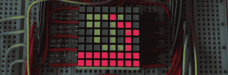

# 用激光笔在 led 上书写

> 原文：<https://hackaday.com/2012/07/27/writing-on-leds-with-a-laser-pointer/>

在[Ch00f]得到 8×8 的 LED 显示屏后，他没有制作 64 像素的视频游戏或 VU 电度表。他把[做成一个激光涂鸦器](http://ch00ftech.com/2012/07/26/the-laser-doodler/)，让他只用一个激光笔就能在这个显示屏上画画。

使用发光二极管作为光传感器并不是什么新鲜事；早在 60 年代末，Forrest Mims III 就发现 led 也可以探测光线。在创造出一种既使用 LED 作为光发射器又作为对环境亮度做出反应的传感器的电路之前，T2 围绕着这个概念进行了试验。

[Ch00f]的激光涂鸦者利用了这一现象，并将其应用于[一个双色 LED 矩阵](http://adafruit.com/products/458)。当光线照射到显示器中的单个像素时，ATMega48 会感应到电流并打开该像素。由于这些像素有两种颜色，[Ch00f]使用一个锁存电路和一个按钮在 Mega 写入显示器的颜色之间循环。

在休息后的视频中，[Ch00f]展示了他的显示器，led 灯响应激光笔而点亮。它可能有点小，但我们可以看到像这样的东西作为一个巨大的艺术装置的巨大潜力。

[https://www.youtube.com/embed/mi5vIlPz_J4?version=3&rel=1&showsearch=0&showinfo=1&iv_load_policy=1&fs=1&hl=en-US&autohide=2&wmode=transparent](https://www.youtube.com/embed/mi5vIlPz_J4?version=3&rel=1&showsearch=0&showinfo=1&iv_load_policy=1&fs=1&hl=en-US&autohide=2&wmode=transparent)