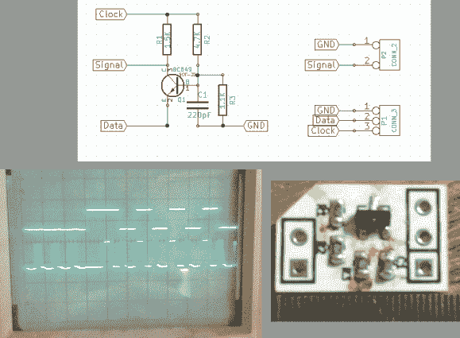

# WS2811 SPI 驱动器使用一个晶体管和无源器件

> 原文：<https://hackaday.com/2014/02/04/ws2811-spi-driver-using-one-transistor-and-passives/>

我们喜欢 WS28xx 项目，因为即使我们从来没有计划使用它们，信号计时就像有史以来最令人上瘾的益智游戏。例如，看看这个 WS2811A 驱动器，它使用硬件 SPI 来产生信号。

WS28xx 产品在 RGB LED 内部放置了一个微控制器，允许在很长的链或大矩阵中单独寻址(仍然是链，但布局不同)。但是，用于解决这些问题的时序方案并不适合传统的微控制器外设。[Brett]对一些试图让硬件 SPI 屈从于 WS2811 意愿的尝试很感兴趣——特别是这篇文章中介绍的[[狡猾 _ 家伙]的工作。他将驱动器简化为一个晶体管、三个电阻和一个电容，向前迈进了一大步。](http://hackaday.com/2013/01/02/three-conceptual-approaches-to-driving-a-ws2811-led-pixel/)

点击上面的链接，他一步一步地描述了电路的工作原理(这里不值得重复解释，因为他自己做了一个非常简洁的工作)。上面的示波器显示了顶部的 SPI 信号和下面的结果时序信号。你会注意到边缘不是很干净，这需要第一个像素非常靠近驱动程序，否则会有进一步退化的风险。但是，由于 WS28xx 驱动器具有一个中继器，可以像这样清除信号，所以在第一个像素之后就一帆风顺了。