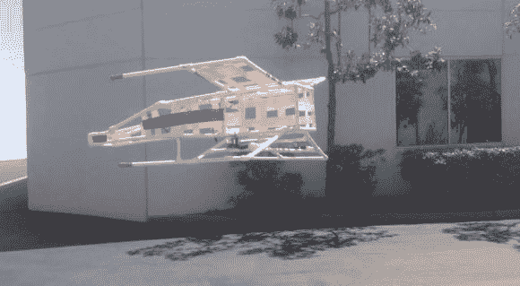

# x 翼三旋翼飞机将《星球大战》带入生活

> 原文：<https://hackaday.com/2014/04/09/x-wing-tri-rotor-brings-star-wars-to-life/>

一旦你意识到你可以让几乎任何东西飞起来，如果你给它绑上一个足够大的道具和马达，你真的开始跳出框框思考。这就是[罗杰]所做的，他从《星球大战》中拿出了这个令人印象深刻的 19 磅、5 英尺长的 X 翼战斗机。

最近[Rodger]在当今技术的帮助下，找到了让电影道具栩栩如生的新乐趣。他从“雷球计划”开始——一个带喷气背包的飞行詹姆斯·邦德人体模型。从那里他带给我们[马蒂·小飞侠工作的悬浮滑板](http://hackaday.com/2014/03/22/its-not-2015-yet-but-marty-and-his-hoverboard-are-already-here/)，现在是 X 翼战斗机，他迄今为止最大的飞行器。

它长约 5 英尺，是一种三转子设计，带有三个 100A ESCs、1200W 1050KV 电机和 12″转子。框架由聚氯乙烯制成，以减轻重量。由于它是一个具有真正矢量推力的三旋翼飞行器，X 翼的偏航比四旋翼飞行器好得多。唯一的问题是它会绕着一个奇怪的道具旋转，这意味着在这种情况下，X 翼会用鼻子转动，而不是尾巴。

无论如何，我们都迫不及待地想看看[罗杰]下一步会尝试什么飞行！留下来看看 X 翼的行动。

[https://www.youtube.com/embed/7VNPcMwwsE8?version=3&rel=1&showsearch=0&showinfo=1&iv_load_policy=1&fs=1&hl=en-US&autohide=2&wmode=transparent](https://www.youtube.com/embed/7VNPcMwwsE8?version=3&rel=1&showsearch=0&showinfo=1&iv_load_policy=1&fs=1&hl=en-US&autohide=2&wmode=transparent)