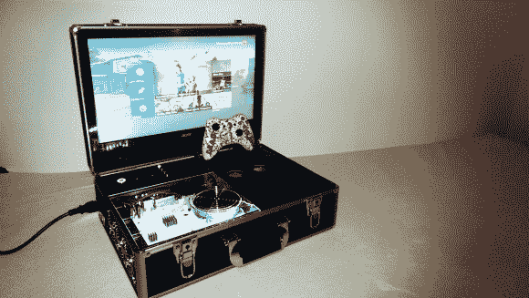

# Xbox 360 超薄得到开膛破肚……漆成白色？

> 原文：<https://hackaday.com/2014/07/17/xbox-360-slim-gets-gutted-and-painted-white/>

我们喜欢便携式游戏机，丹尼尔·福斯陶的这个也不例外。这是一个精美的黑色 Xbox 360 超薄铝制公文包，配有屏幕和完整的音频系统！

他从掏空 Xbox 360 超薄机身开始，扔掉了几乎所有的原始外壳，除了光驱盖。他接下来所做的完全是为了美学，但是非常棒。他真的把主板拿了出来，用胶带把一些重要的组件粘上，然后把整个东西喷成白色！我们不太确定这对一些组件会有什么影响，但它似乎是有效的，并在他的树脂玻璃外壳下给它一个真正独特的外观。

他安置了它的其余部分(包括定制的冷却风扇！)放在一个漂亮的铝制公文包里，配有一个宽屏液晶显示器和电脑扬声器。他甚至把电源安装在里面——你所要做的就是插上电源！还有至少一个控制器的空间，其固定点兼作光盘驱动器弹出的空间。

这是一个超级光滑的建筑，他甚至制作了一个演示视频:

[https://www.youtube.com/embed/DWyWxIrI434?version=3&rel=1&showsearch=0&showinfo=1&iv_load_policy=1&fs=1&hl=en-US&autohide=2&wmode=transparent](https://www.youtube.com/embed/DWyWxIrI434?version=3&rel=1&showsearch=0&showinfo=1&iv_load_policy=1&fs=1&hl=en-US&autohide=2&wmode=transparent)

我们已经看到[许多 PS3 和 Xbox 360 便携版](http://hackaday.com/2014/07/08/the-homebrew-xbox-360-and-ps3-portable/)，但是还没有 PS4。有人能接受挑战吗？