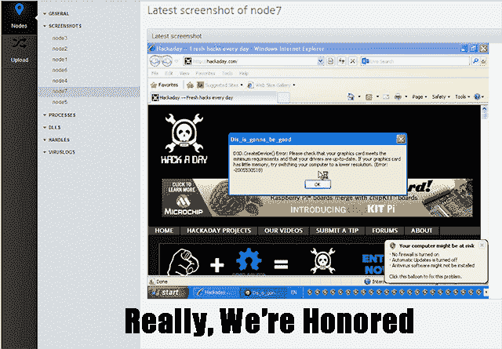

# Xkcd 的病毒水族馆成为现实

> 原文：<https://hackaday.com/2014/06/28/xkcds-virus-aquarium-made-real/>

数量惊人的项目在某种程度上受到了网络漫画 xkcd 的影响，但通常不会像这样直接。漫画 350《网络》讲述了一个非常古怪的人的故事，他让多个虚拟机运行不受保护的旧版本 Windows。在虚拟机之间，它们拥有几乎所有的病毒，实际上是一个计算机病毒水族馆。

[现在它是一个真实的东西](http://wecan.hasthe.technology/)，最棒的是，它对互联网开放，普通人可以查看，所有七个节点的屏幕截图每 30 秒更新一次，可以查看每个节点上的所有进程，*和互联网上的任何人都可以上传任何文件到节点*。所有上传到节点的文件都被执行，因此您可以实时看到“1TB _ of _ porn _ this _ take _ a _ while _ to _ upload . exe”对节点 3 的影响。

病毒水族馆的想法很酷，但实际上当项目本身变得更有趣时。每 24 小时，每个节点上都会运行一次病毒扫描程序。到目前为止，所有的节点都是干净的，这不是一个病毒水族馆，而是一个脚本 kiddie 水族馆。至少在一个节点上，TeamViewer 正在运行，但你我都不知道如何让它运行。

编辑:感谢在其中一个节点上加载 Hackaday 的人。

