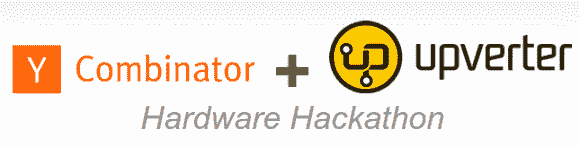

# Y Combinator 和 Upverter 主机硬件黑客马拉松

> 原文：<https://hackaday.com/2013/02/01/y-combinator-and-upverter-host-hardware-hackathon/>

创业加速器 Y Combinator 和 Upverter 正在联手举办一场[硬件黑客马拉松](http://upverter.com/hackathons/yc-hackathon-2013/ "Hardware Hackathon")。这项活动旨在鼓励硬件黑客聚集在一起，在 12 小时的冲刺中设计新产品。包括 Pebble、Octopart 和 Lockitron 在内的初创公司也将参与其中。

这是一个免费的活动，获胜的团队将获得他们的设计作品。参与者将保留他们设计的权利，获得免费的专业 Upverter 帐户，并有机会与 Y Combinator 的一些合作伙伴聊天。这对于那些希望创建自己的硬件创业公司的人来说是一个很好的机会。

该活动于 2 月 23 日在加州山景城的 Y Combinator 办公室举行。报名截止到 2 月 8 日。如果你在湾区做硬件，你应该看看这个活动。