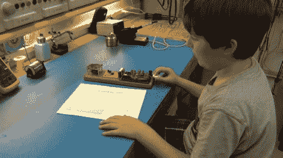

# 如果你的孩子用莫尔斯电码练习拼写，你可能是一个令人讨厌的父亲

> 原文：<https://hackaday.com/2012/05/08/you-might-be-a-geeky-dad-if-your-kids-practice-spelling-in-morse-code/>

如果孩子们专注于手头的话题，他们会学得更好。[托德]发现他的儿子每天晚上都乞求练习拼写单词。他将它们全部转换成莫尔斯电码，并在他们一起建造的莫尔斯电码练习站上敲击每一个。首先，托德将键控器连接到他的 Fluke 87 仪表，使用连续性测试仪在每次按键时发出嘟嘟声。但这只是一个临时设置，直到[托德]可以帮助指导他的小家伙通过一些电路设计和组装。

替换基于 555 定时器。他们抓起一本电子工程书，发现了原理图和一个莫尔斯电码引物。手里拿着零件[Todd]看着他的儿子磨练他的焊接技能。完成的项目使用定时器芯片产生从板载扬声器听到的音频。如果你从未享受过教孩子如何焊接的乐趣，你会喜欢看这个视频的。

[https://www.youtube.com/embed/z2rQoBFQol8?version=3&rel=1&showsearch=0&showinfo=1&iv_load_policy=1&fs=1&hl=en-US&autohide=2&wmode=transparent](https://www.youtube.com/embed/z2rQoBFQol8?version=3&rel=1&showsearch=0&showinfo=1&iv_load_policy=1&fs=1&hl=en-US&autohide=2&wmode=transparent)