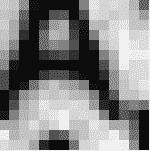

# 你的鼠标是一个可怕的网络摄像头

> 原文：<https://hackaday.com/2014/01/14/your-mouse-is-a-terrible-webcam/>

你的光学鼠标包含一个非常小、分辨率非常低的摄像头，这并不奇怪。[Franci]决定拆开他的一只旧鼠标，把那个微小的光学传感器变成一个网络摄像头。

在[弗朗西]的罗技 RX 250 是一个 ADNS-5020 光学传感器。这款三线式 SPI 器件采用 8 引脚封装，是一款 15×15 像素灰度图像传感器。[Franci]通过推出 Arduino 和以太网屏蔽开始了这个项目。将上拉电阻焊接到图像传感器的复位引脚后，连接电路的其余部分就像将几根电线焊接到 Arduino 一样简单。

Arduino sketch 通过串行连接将每个像素的图像数据发送到计算机。一点儿 javascript 和一点儿 HTML 就能获取这些像素数据，并把它变成一个网页，上面有[Franci]鼠标正下方的任何东西的实时视图。

下面是鼠标摄像头的视频。

 [https://www.youtube.com/embed/Ix6532mrIKA?version=3&rel=1&showsearch=0&showinfo=1&iv_load_policy=1&fs=1&hl=en-US&autohide=2&wmode=transparent](https://www.youtube.com/embed/Ix6532mrIKA?version=3&rel=1&showsearch=0&showinfo=1&iv_load_policy=1&fs=1&hl=en-US&autohide=2&wmode=transparent)