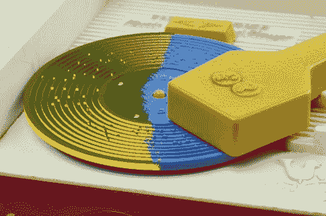

# 多亏了 3D 打印机，费雪牌电唱机上的齐柏林飞艇

> 原文：<https://hackaday.com/2012/09/04/zeppelin-on-the-fisher-price-record-player-now-thanks-to-a-3d-printer/>

[弗雷德·墨菲]继续修改他为费雪牌玩具电唱机定制唱片的方法。他现在能够 3D 打印光盘了。这种玩具的工作原理很像一个音乐盒，在唱机的“盒子”里有一把梳子，唱片上有凹槽，当梳子转动时，凹槽会拨动梳子的手指。他之前开发了一种减色法，让他用一块固体塑料制作出[唱片。但是这种加法意味着更少的浪费。](http://hackaday.com/2012/05/24/fisher-price-record-player-plays-stairway-to-heaven/)

项目的音乐创作部分与之前的版本相同。这是因为很难超越他编写的 C#软件，它是一个作曲工作室。困难在于获得清晰的磁盘指纹。光盘上的脊是 0.7 毫米，所以你需要一个高分辨率的校准打印机。用 ABS 和他所谓的“Vero clear”塑料印刷。前者有效，但他用后者得到了更好的结果。