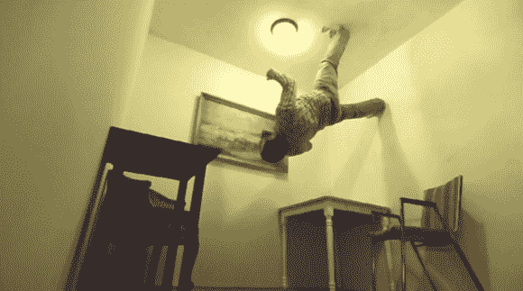

# 预算上的零重力

> 原文：<https://hackaday.com/2013/09/25/zero-gravity-sort-of-on-a-budget/>

25 万美元，维珍银河可能超出了大多数人的价格范围；甚至失重飞行也要 5000 美元。不过，你可能很幸运，因为[贾斯汀]和他的朋友们花了 350 美元(警告:噪音很大@开始)建造了一个旋转室，它可以让你的世界天翻地覆。该视频提供了构建的延时，但你可能会想要跳过 5 分钟来获得真正的乐趣。

这可能不是反重力，但抓住家具以防止飞向天花板看起来很有趣。这个房间的工作原理就像游乐场最受欢迎的“重力加速器”一样。2 辆叉车支撑着一个巨大的木制立方体，其中包括熟悉的家居用品:干墙、地板和一些家具。[Justin]设法借了两个车轮，安装在立方体相对两侧的墙中间。两个脚轮支撑每个轮辋，叉车将脚轮举得足够高，让几个朋友可以手动吊起所有东西。

[https://player.vimeo.com/video/74254518](https://player.vimeo.com/video/74254518)

【via [ISO 1200](http://www.iso1200.com/2013/09/diy-zero-gravity-350-spinning-set.html) 和 [DIY 摄影](http://www.diyphotography.net/gravity-defying-set-will-give-you-spiderman-powers)

[谢谢戴夫]